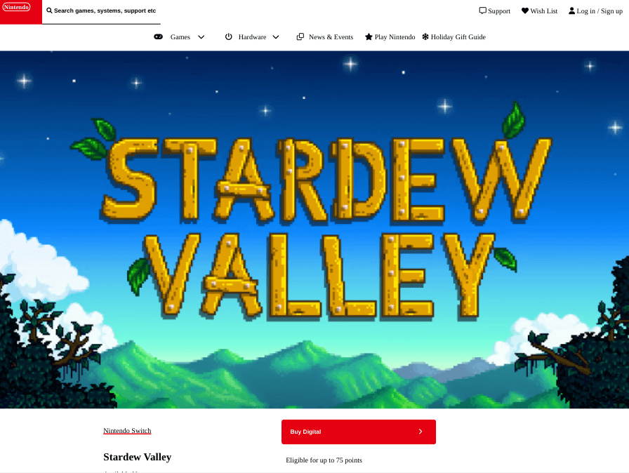
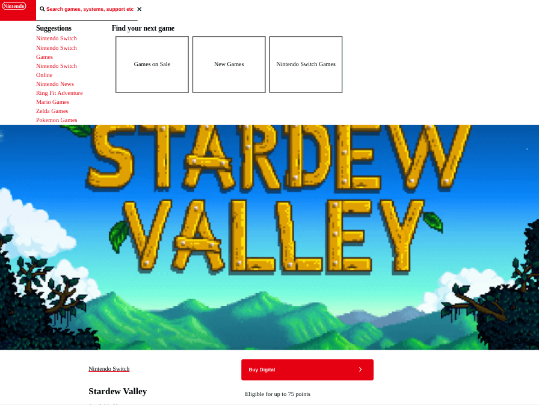
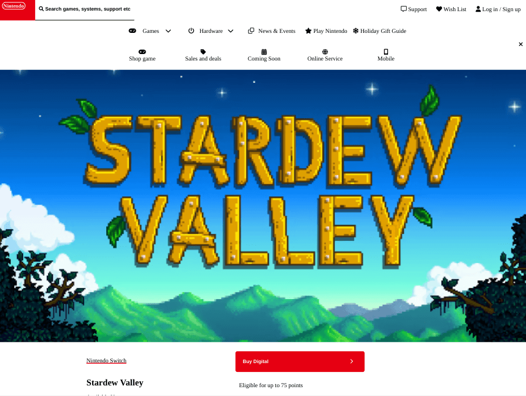
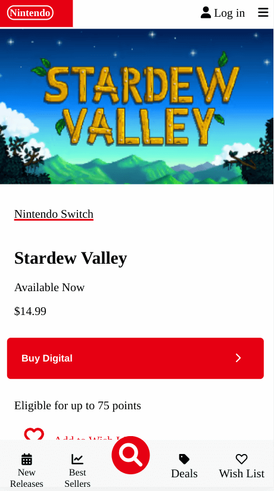
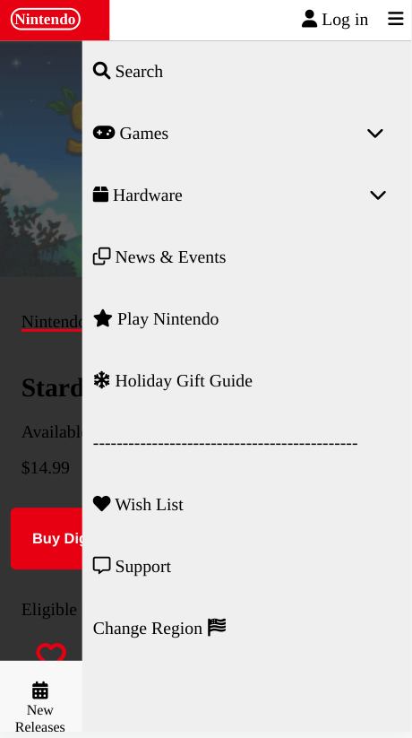
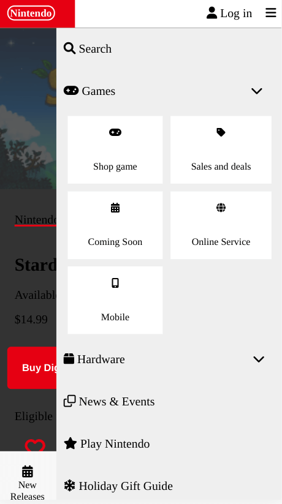

<h1 align="center">Nintendo</h1>

   Solution for a challenge from  <a href="https://frontendpractice.com" target="_blank">Frontendpractice.com</a>.

  <h3>
    <a href="https://jdegand.github.io/nintendo">
      Github Pages
    </a>
     | 
    <a href="https://www.frontendpractice.com/project/nintendo">
      Frontend Practice    
    </a>
  </h3>

## Table of Contents

- [Overview](#overview)
  - [Built With](#built-with)
- [Features](#features)
- [Useful Resources](#useful-resources)

## Overview

### Built With

- Grid 
- Flex

## Features

The [challenge](https://www.frontendpractice.com/project/ableton) was to build an application to complete the following user stories:

- [x] User story: Recreate the layout
- [x] User story: Try creating the image lightbox gallery & the search bar's dropdown panel.
- [ ] User story: If animations are your jam, recreate the effect seen when hovering the hearts on this page.

## Useful Resources

- [Nintendo](https://www.nintendo.com/games/detail/stardew-valley-switch/)
- [MDN Docs](https://developer.mozilla.org/en-US/docs/Web/HTML/Element/dl) - dl tag
- [W3 Schools](https://www.w3schools.com/howto/howto_js_accordion.asp) - Accordion
- [W3 Schools](https://www.w3schools.com/howto/howto_js_lightbox.asp) - Lightbox
- [Free Code Camp](https://www.freecodecamp.org/news/how-to-use-avif-images-on-your-website/) - avif images
- [Codepen](https://codepen.io/chofsho/pen/OrqpGy) - SVG hover
- [YouTube](https://www.youtube.com/watch?v=9i3dWkncvZA) - CSS movement path
- [MDN Docs](https://developer.mozilla.org/en-US/docs/Web/CSS/CSS_Motion_Path) - CSS Motion Path
- [Stack Overflow](https://stackoverflow.com/questions/23440364/what-does-d-mean-in-svg-path) - d of a svg